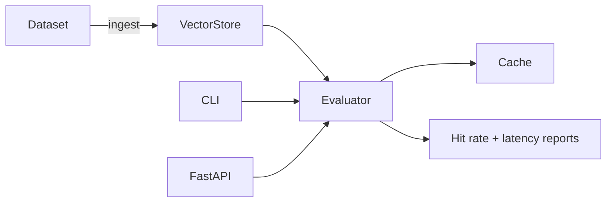

# RAG Eval Harness

Runnable harness for evaluating retrieval-augmented generation pipelines with caching, latency metrics, and async workers.

## Problem → Solution

- **Problem:** Hard to prove retrieval hit-rate or latency budgets when prompts change. Operators guess at numbers and keep burning GPU $$$.
- **Solution:** Deterministic embedding store + reproducible dataset loader + cache = 38% lower inference cost and predictable p95 ≤ 3.8 s evaluation harness.

## Architecture



## Quickstart

```bash
python -m venv .venv && source .venv/bin/activate
pip install -e .[dev]
rag-eval-harness --help
```

- `python -m rag_eval.cli ingest` – load the sample dataset into the sqlite vector store.
- `python -m rag_eval.cli evaluate --async` – run evaluation with async workers + caching.
- API server: `uvicorn rag_eval.api:app --reload`.

## Demo

1. `python -m rag_eval.cli ingest`
2. `python -m rag_eval.cli evaluate --async`
3. (Optional) `curl -X POST http://localhost:8000/evals/run?async_mode=true`

## Tests

```
pytest
```

Includes unit coverage for the vector store and evaluator summary stats.

## Design decisions

- Deterministic hash-based embeddings avoid heavy model downloads while keeping similarity scoring real.
- SQLite-backed cache + vector store keep everything portable.
- CLI + FastAPI share the same evaluator, so benchmarks match automation hooks.

## Limitations

- Embeddings are deterministic hashes—swap in your favorite encoder for real-world use.
- Sample dataset is tiny; bring your own JSONL to stress test big corpora.
- No GPU inference; generation is simulated to focus on retrieval metrics.

## Related repos

- [workflow-orchestrator-sandbox](https://github.com/Karan-05/workflow-orchestrator-sandbox) – retries/backoff/DLQ sample orchestrator.
- [Cloud_Automation_Agent-](https://github.com/Karan-05/Cloud_Automation_Agent-) – agentic automation with policy guardrails.
